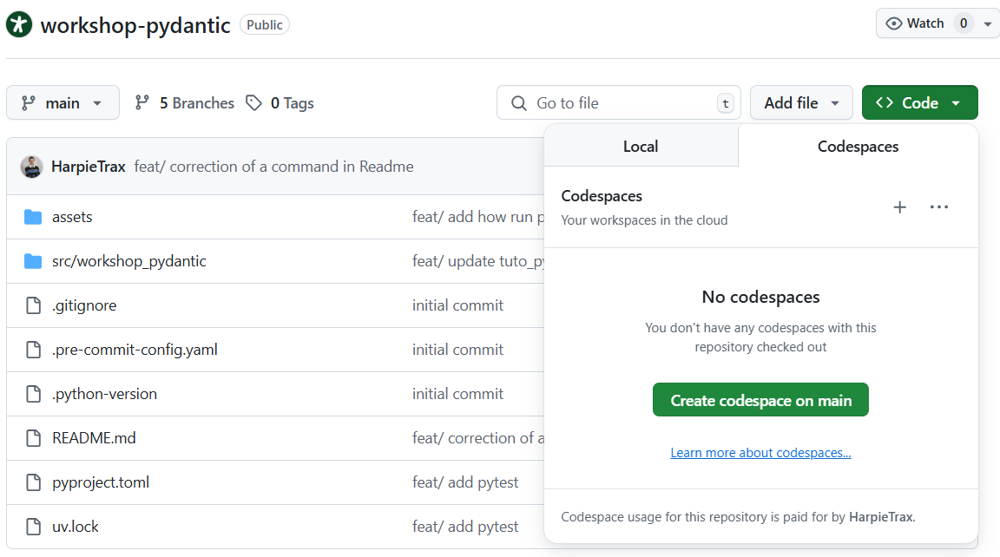
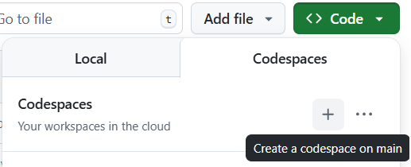
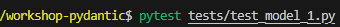
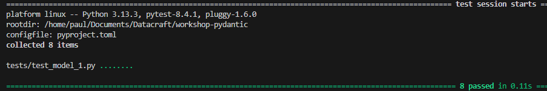

# Pydantic Workshop – Learn by Doing


This repository is designed to help you learn **Pydantic**, a powerful Python library for data validation and parsing.
Pydantic is widely used in modern Python projects such as FastAPI, data pipelines, and configuration management.
It also enables **structured data generation from AI models**, allowing you to turn raw LLM output into clean, validated Python objects.

---

## Table of Contents
- **[Workshop Goals](#workshop-goals)**
- **[Branch Organization](#branch-organization)**
- **[Project Structure](#project-structure)**
- **[Setup](#setup)**
- **[Practical Session](#practical-session--build-and-validate-pydantic-models)**
- **[Check Your Progress](#check-your-progress-without-spoilers)**

---

## Workshop Goals

- Understand the core principles of **Pydantic** (models, type validation, automatic parsing).
- Practice with one progressive exercise available in three levels of difficulty.
- Discover how to structure clean and robust data models in Python projects.
- Learn to integrate Pydantic with AI models for structured and validated data generation.


## Branch Organization

| Branch         | Description                                                                 |
|----------------|-----------------------------------------------------------------------------|
| `main`         | Introduction to Pydantic with a mini course and simple examples.           |
| `easy`         | Guided version of the exercise: fill-in-the-blanks and code scaffolding provided. |
| `intermediate` | Moderate guidance: fewer hints, focus on nested models and custom validation. |
| `hard`         | Minimal guidance: only the exercise prompt is provided, for full autonomy. |
| `correction`   | Full solution with explanations and good practices.                         |

> Feel free to start with the `hard` branch if you're up for a challenge.
> If it gets tricky, switch to `intermediate` or `easy` for progressive hints.
> Don't forget to refer to the mini course in `main` — it covers all the key concepts you need.


## Project Structure

The project is structured into four main directories, `model_1`, `model_2`, `model_3`, and `model_4`, each representing a stage in the exercise. Each directory contains the following files:

- `people.py`
- `company.py`
- `event.py`
- `club.py`
- `enums.py`

Each stage builds upon the previous one, adding complexity and new features. The `TODO.md` file at the root of the project contains the instructions for each stage.

The `Structured Output` directory

In this final stage, you will find a directory named `structured_output`. This directory contains a practical example demonstrating the advanced capabilities of Pydantic. It showcases how to generate and validate structured data, representing the culmination of techniques learned in previous stages.

#### Key Components :

- **Directory**: `structured_output`
  - This directory includes files that illustrate the integration of Pydantic for structured data handling.

- **Objective**: The goal of this stage is to provide a comprehensive example of how Pydantic can be utilized to ensure data integrity and structure, offering insights into the potential and versatility of Pydantic in real-world applications.

#### Environment Setup for Structured Output :

To enable structured data generation and see results in the `structured_output` section, you need to create a `.env` file at the root of the project and add your **OpenAI API key** as follows :

```plaintext
OPENAI_API_KEY=your_api_key_here
```

This step is optional if you only want to explore the structure and validation aspects without generating data from AI models.

Additionally, there is a `tests` directory containing test files for each stage to validate your implementation:

- `test_model_1.py`
- `test_model_2.py`
- `test_model_3.py`
- `test_model_4.py`


## Setup

You can complete this workshop in **two ways**:

### Option 1 — Local setup (with classic VS Code)

If you're comfortable working locally, simply clone the repository and use `uv` to install dependencies.

Install `uv` (Python package manager with virtual environment support):

```bash
curl -LsSf https://astral.sh/uv/install.sh | sh
```

>If the uv installation fails or you're having trouble with your virtual environment, you can try running the workshop in the cloud using GitHub Codespaces instead.

Then, run `uv sync` to install dependencies

```bash
uv sync
```

Finally, activate your environment using:

```bash
source .venv/bin/activate
```

### Option 2 — Run in GitHub Codespaces (cloud)

If you prefer not to set up anything locally, you can run everything directly in the browser via **GitHub Codespaces** — no installation required.

1. Go to the repository on GitHub.
2. **Select the branch you want to work.**
3. Click on the green **Code** button → "Create codespace on `Branch's name` " 
4. In the terminal that opens in the Codespace, run the same commands as you would locally



Install `uv` (Python package manager with virtual environment support) :

```bash
curl -LsSf https://astral.sh/uv/install.sh | sh
```

>If the uv installation fails or you're having trouble with your virtual environment, you can try running the workshop in the cloud using GitHub Codespaces instead.

Then, run `uv sync` to install dependencies

```bash
uv sync
```

Finally, activate your environment using:

```bash
source .venv/bin/activate
```

**Important** : Codespaces are tied to the branch selected when you create them.
If you want to switch branches later, go back to GitHub, select the new branch, and click on the + (plus) icon in the top right corner to create a new Codespace for that branch.
You will then need to repeat the same terminal commands (`curl`,`uv sync`, ...) inside the new Codespace.



## Practical Session – Build and Validate Pydantic Models

This workshop offers a single exercise available in five stages, tailored for learners of all backgrounds.

We recommend starting with the default branch (`main`) to go through the short tutorial and learn how Pydantic works.

Once you're familiar with the basics, you can move on to the other branches depending on your desired challenge level.

Each branch (`easy`, `intermediate`, `hard`) contains:

- Four sequential model directories: `model_1`, `model_2`, `model_3`, and `model_4`.
  These represent progressive steps of the exercise and must be completed in order.
  Each directory builds upon the previous one — serving both as a **partial correction** and a **new step** that adds complexity.
- A final directory `structured_output` that demonstrates advanced usage of Pydantic for generating and validating structured data, showcasing the culmination of techniques learned in previous stages.
- Four corresponding test files located in the `tests/` folder: `test_model_1.py`, `test_model_2.py`, etc.
  Each test file is dedicated to checking the behavior of its associated model step.

To access the **complete final solution**, refer to the `correction` branch, which provides the full version of `model_4` and the `structured_output`.

The structure is the same across all branches to ensure consistency in learning progression.

To switch to a specific version of the workshop, run :

```bash
git checkout <branch-name>
```

Replace `<branch-name>` with one of the following :

- `main`         → base structure  
- `easy`         → simplified version  
- `intermediate` → default level  
- `hard`         → advanced version  
- `correction`   → full solution 

---

## Check Your Progress Without Spoilers

As you complete each stage (`model_1` to `model_4`), you can validate your implementation by running the corresponding test file located in the `tests/` folder, such as `test_model_1.py`, `test_model_2.py`, etc., found in all branches.

To validate your progress, run the test corresponding to the current model step :

```bash
pytest tests/test_model_N.py
```

*Replace `N` with the model number.*



Make sure you're in the project root (where the workshop-pydantic folder is), not inside `src/` or `tests/`.


When you run the command in your terminal, you should see an output like the image above — showing which tests failed or passed. If everything is correct, you'll see only green "passed" lines.


> **Note:** Do not modify the test files. They are designed to verify expected behavior at each stage. While they cover key elements, they do not guarantee completeness or best practices — for a full review, you can refer to the final implementation in the `correction` branch.

---

*You're now all set — pick your branch, open the exercise, and start modeling with Pydantic !*
